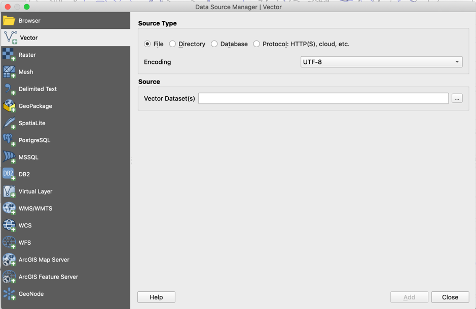
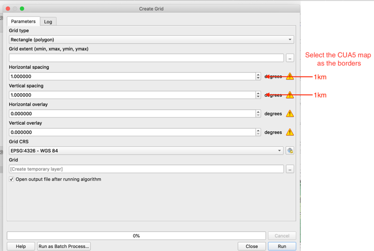
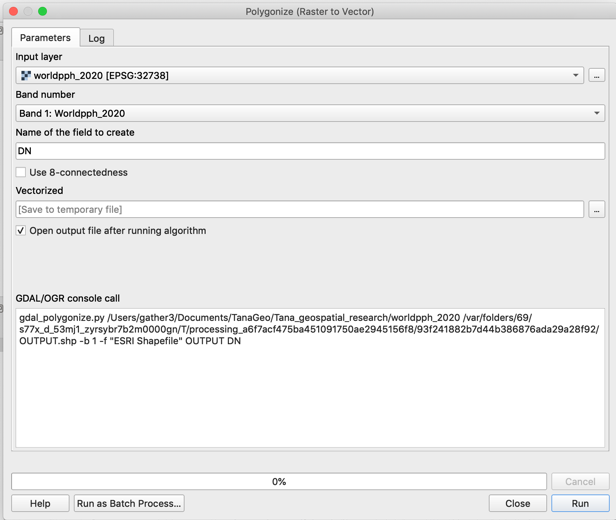
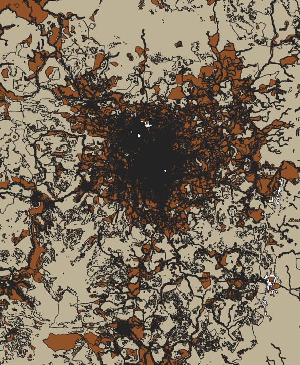
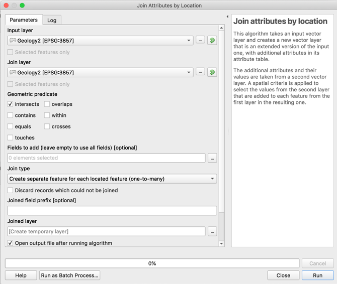
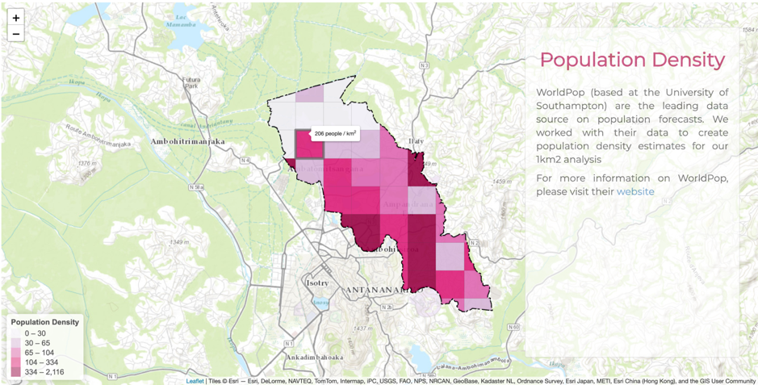
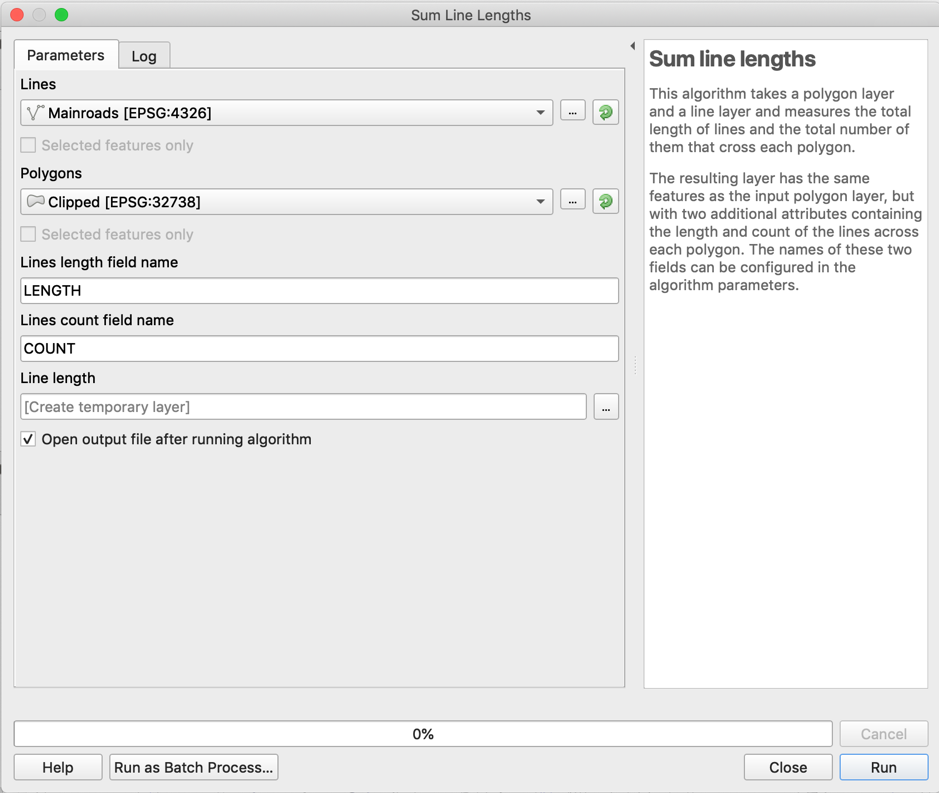
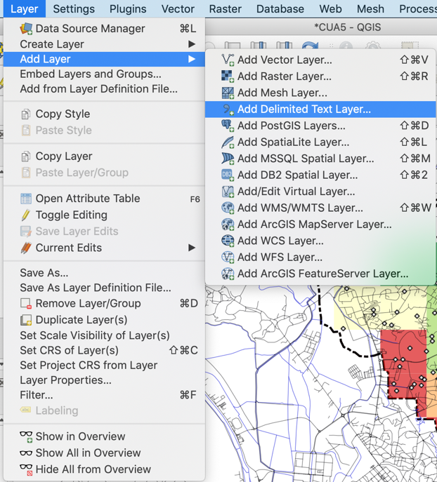
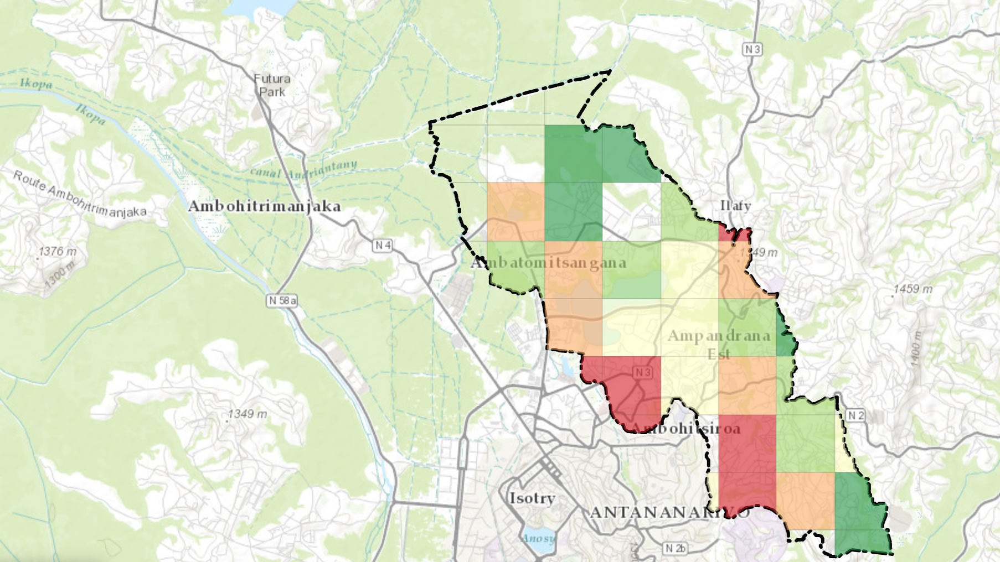

# Geospatial processing using QGIS

This section has the objective to explain how to replicate the Sanitation risk presented in the Shiny app
using QGIS, an open source tool used for geoprocessment.
The document is divided into five subsections:
1. Loading the borders
2. Creating the grid
3. Population analysis
4. Roads and Rivers processing
5. Risk calculation

All the data used is disponible for free, to know more about contatct us on hello@gatherhub.org

## Loading the borders
Adding a shapefile is really simple, just go to 'Add Layer' functionality (CMD+SHIFT+V), and load you file into
QGIS. In case of wrong location, check the shapefile coordinate system and change it to WGS84.

## Creating the grid
After loading the borders, go to the function 'Create grid' , select the 'Rectangle (polygon)' option,
add the map in the 'Grid extent' option and for the horizontal and vertical spacing add a reasonable size,
since all the calculation depends on how many toilets are located inside the grid, smaler grids leads to a more specfic,
but more volatile result, bigger grids leads to more stable, but too generic result.

## Population analysis

To add the population is really similar to loading the borders, but instead of a layer, normally is a raster,
and QGIS has a specific function for raster on the 'Add Raster' option (CMD+SHIFT+R).
To work along with the CUA 5 border map and the grid, you need to polygonise the population raster,
to do so, just go to Raster > Conversion > Polygonise.

After Polygonising the population data, it is necessary to check if the polygons are valid,
for example, if lines cross each other or open polygons.
To make that go to Geometry Tools > Check Validity, with this, you shall get 3 items, one is the valid map, the second is the invalid map and the third item is the regions where the map is invalid.
In the image, the darker colour represents the valid area and the lighter represents the invalid area, if you zoom in the image on QGIS, you can find the invalid points marked as red dots.

Now it is time to apply the map’s properties on the grid,
to do that you need to use the tool called Join Attributes by Location,
which will copy the map properties into the grid. 
In case of multiple values inside of the grid, the average value will be selected.

After adding the population into the grid,
just clip the grid in the same shape as the CUA5 and in the end we are going to have this:

## Roads and Rivers

To add the road and rivers shapefiles, just add like in the first subsection.
After that, to calculate the River/Road density, we have to sum all the lines inside each grid and colour it accordingly.
To make the sum of lines we use the function “Sum line lengths” that will take as input the Road/River shapefile and the grid. 

## Risk calculation

For the Risk Calculation, we need to load the sample dataset first, to do that just go to Layer > Add Layer > Add Delimited Text Layer.
QGIS is going to assign the latitude and longitude fields automatically based on the column’s names,
the files that you can use are the Final_Sample.csv (limited) or the Risk_Toilet_Final.csv (more complete).
A good observation is that since the actual data has random latitude and longitude, we have to clip it into the CUA5 map,
limiting the number of points that we have to create the risk.

The next step is to join the previous files into the sample dataset, for that we need to go to the sample file properties on QGIS and find the Join section,
there, we will merge the datasets finding similar parameters (in the sample toilet case, the ID column represents in which grid the point is located).

After joining the files, we have to apply the risk formula to create a new column,
to make that, open the sample file’s attribute table, and open the field calculator (ctrl + I) and apply the formula in the risk document.

Hint: use sum(formula, group_by:= id) to make the clustering of the points in the same area.

The image below shows how the final risk looks like. To add that to shiny, just export the final layer,
and follow the main documentation.

