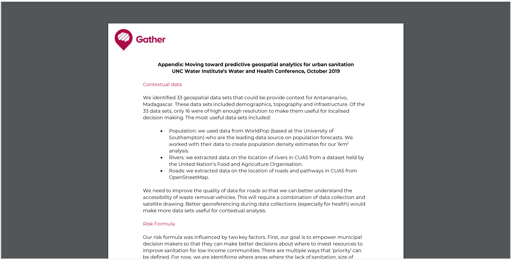

# Sanitation Risk

## Everything happens somewhere
Geospatial data sets enrich our understanding of what happens where. We wanted to understand what  geospatial data was available on Antananarivo in Madagascar. This has enabled us to  explore predictive geospatial analysis for municipal and sanitation decision-makers who are looking to expand sanitation services and prioritise investment for at risk areas.

## State of non-sanitation data

Most  non-sanitation (contextual) data sets for Antananarivo exist as images with limited location information. These need to be converted into shape files: they need to be georeferenced to ‘glue’ the image to a base map and then vectorised to add the data. 

For more information on how we assessed and prepared non-sanitation data sets, check the [Geospatial Analysis section](link)

## Shiny App

The Shiny app has the functionality to aggregate all our research on the Sanitation Risk, Geospatial analysis and Data Analysis on one simple web platform. The Shiny library was the platform selected to make the web interface, since all the other parts were developed on the R language.

The next subsections is going to explain each section of the Shiny app and its application to the Sanitation risk.

### Sanitation risk

The first tab shows the Sanitation risk, the risk of a sanitation disease outbreak, on the fifth arrondisement on the city of Antananarivo, from green to red, where green represents low risk regions and red represents high risk regions.

### Toilets

The second tab represents the toilets location on each area, where clicking on each of them shows its individual attributes, such as capacity, monthly number of users and days since last cleaning.

### Population

The third tab shows the population density over each area, the data was collected based on the 2020 World Pop prediction. On the risk formula the population is critical to define if a region is a high risk or low risk one, since it is more inclinable to disease spread than a place with lower population density.

### Rivers & Roads

The fourth and fifth tab shows the environment risk elements, Rivers and Roads, showing the cumulative length of each element on the grid. 

### Technical details

For more detailed information, you can check our file explaining each section that contains the formula explanation, motivation for each of that tabs and how do we get to the final result.

## Contact
We are always looking to improve our method to provide a better sanitation to the world, so we are welcome to a new idea or contribution for our project.

In case of questions please email us on hello@gatherhub.org
